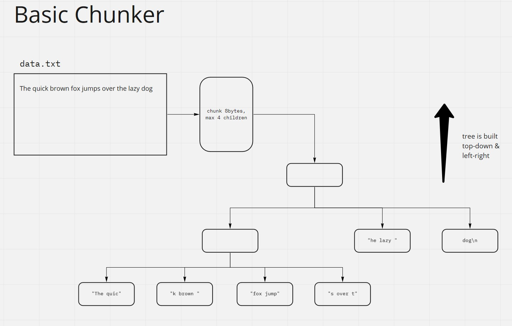

# file chunking

I was reading about IPFS and I got really interested in the way they're
splitting files and saving them in the (IPFS) repo. This project just
contains my notes and experiments related to this :grimacing:

## basic chunker

The basic chunker just naively splits content into equal chunks and
tries to build a tree from it. Only the leaves contain data and each
node can have upto a defined number of links.

Here's how the tree would look for a chunk-size of 8 bytes and 4 links
per node

This is not a balanced tree, most content is concentrated on the left.
